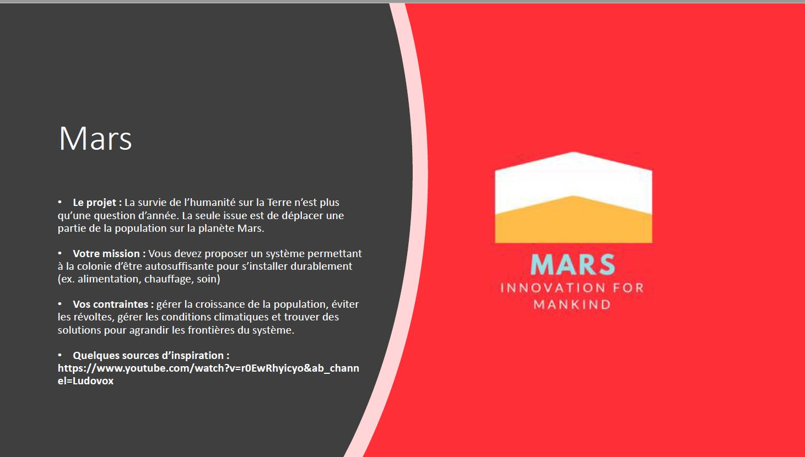
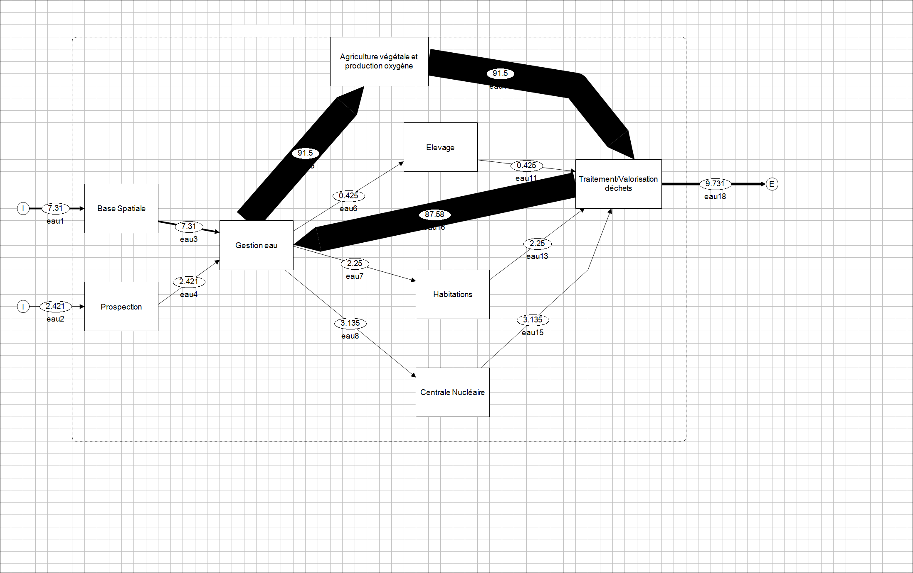
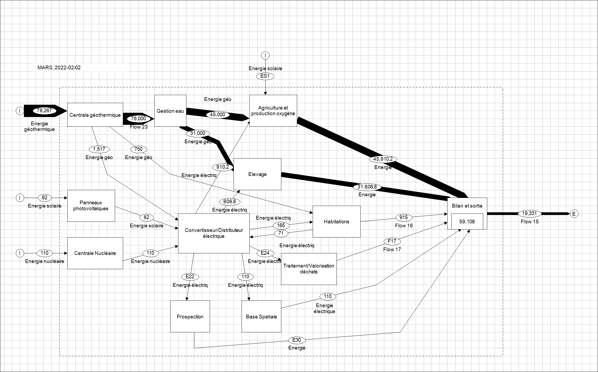

# _Projet final en analyse des systèmes complexes (économie): le projet MARS

## Problématique

Elle est présentée ici:  

  

## Structure du projet

Le rendu de notre projet est le rapport Mars.pdf.  

## Annexe : Les schémas obtenus, visualisation.

Ils ont été conçus avec STAN version 2.6.801.

On donne le schéma des flux d'eau et d'énergie :  

