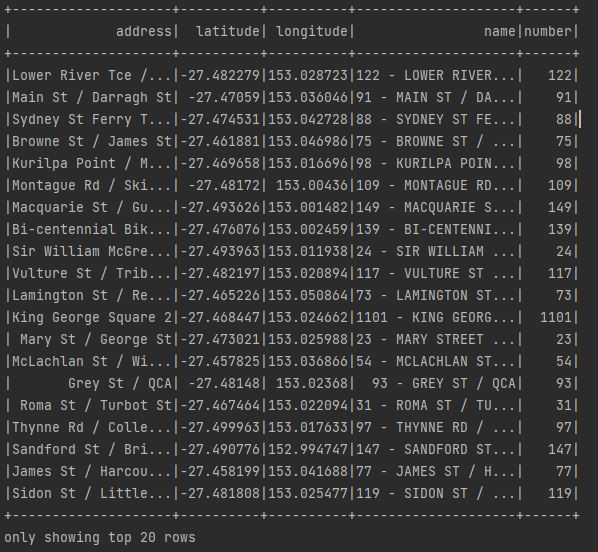
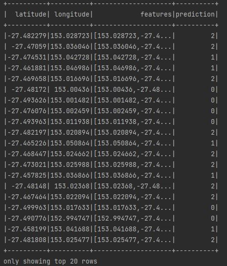
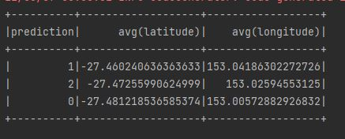
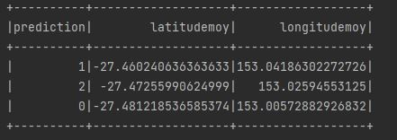
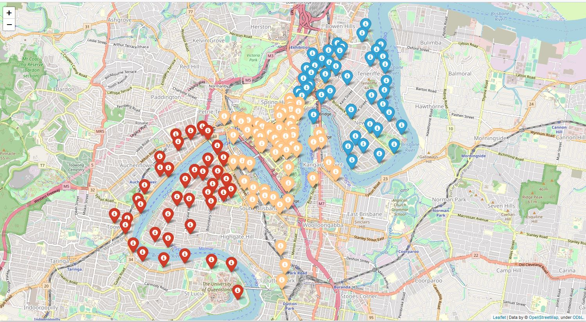

# _Projet final : Les KMeans avec Spark_

## Objectif

L'objectif est de mettre en évidence des clusters via la méthode des
K-Means dans l'implantation des stations de vélos de la ville de
Brisbane en Australie (système "Brisbane City Bike").
Pour ce faire, nous utiliserons Spark.

## Structure du projet

Le répertoire "data" contient le fichier de données Bristol-city-bike.json qui est au format
JSON.  
Le répertoire "captures" contient les captures d'écran au format JPEG.  
Le répertoire "map" contient le Jupyter Notebook avec le code Python et le rendu de la carte Leaflet
au format HTML.  
Le répertoire "exports" contiendra le fichier des données traitées avec les prédictions.  
Le répertoire SRC contient le fichier Main.scala qui traite les données et
applique l'algorithme des KMeans.  

Le répertoire "config" contient le fichier de configuration "config.properties".  

Les autres fichiers pour l'import des dépendances (POM)
et le présent readme.md sont à la racine du projet.

## Exécution

Pour l'exécuter en ligne de commande, on utilisera :  
spark-submit --master local --class Main path\Kmeans-spark\out\artifacts\Kmeans_spark_jar\Kmeans-spark.jar

## Etapes successives

Les différentes étapes sont les suivantes :

 1. Instancier le client SparkSession.
 2. Créer un fichier config.properties contenant les informations relatives aux paramètres du programme en dur 
    (notamment les paths).
 3. On crée une fonction "getProp" qui permet d'aller récupérer lesdites informations et 
    on importe le fichier de données avec la SparkSession.
 4. On crée le nouveau dataframe Kmeansdf qui contient uniquement la latitude et la longitude.
 5. On ajoute la colonne "features" à ce dataframe et on applique au nouveau dataframe ainsi formé l'algorithme KMeans.
 6. On obtient le dataframe fitted contenant les prédictions (groupe d'appartenance pour chaque observation).
 7. On visualise les latitudes et longitudes moyennes par groupe.
 8. On exporte le dataframe fitted contenant les prédictions (au format json par exemple).
 9. Visualisation des clusters sur une map via Python.
 10. Création d'un repo GIT dûment documenté.

Les points 1 à 6 sont réalisés dans le fichier Main.scala.
Nous obtenons _in fine_ les résultats suivants :

## Visualisation des résultats obtenus

3. Le fichier JSON une fois importé présente les données ainsi :
  

6. On obtient le dataframe fitted :

7. Les latitudes et longitudes moyennes par groupe :

- Cela donne en Spark DSL :

- Et en Spark SQL :

Bien entendu, les résultats sont identiques.
Par ailleurs, d'un groupe à l'autre, les valeurs moyennes sont très proches, 
ce qui est logique vu la grande proximité géographique des différents emplacements.

9. L'utilisation de Python et du package "folium" (utilisant les cartes de type leaflet) permet
de visualiser les clusters obtenus.
Il n'a pas été possible de numéroter et légender directement les marqueurs suivant le groupe (tout du moins
pas de façon satisfaisante esthétiquement).

